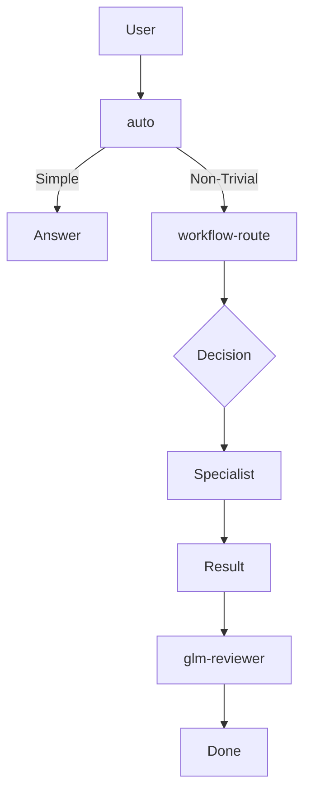

# OpenCode Config
Global OpenCode setup with a primary orchestration workflow, automatic routing to specialized subagents, GPT planning for large implementation work, and a default GLM final review with GPT escalation only when needed.

## Files

| File | Purpose | Description |
|------|---------|-------------|
| `opencode.json` | Main config | Models, MCP servers, custom commands |
| `AGENTS.md` | Communication rules | Ultra-terse "caveman" mode for token saving |
| `agents/` | Agent definitions | Subagent prompts and configurations |
| `tools/workflow-route.ts` | Routing tool | Deterministic task router |
| `WORKFLOW_DIAGRAM.md` | Workflow diagram | Mermaid workflow visualization |

## Primary Model

- default model: `opencode-go/kimi-k2.6`
- small_model: `opencode-go/deepseek-v4-flash`
- default agent: `auto`

## Configured MCP Servers

### Jira
- type: `remote`
- url: `https://mcp.atlassian.com/mcp`
- enabled: `true`
- Tools: `jira_*` (only enabled for `jira` agent)

## Model Roles

| Model | Role | Agent |
|-------|------|-------|
| Kimi 2.6 | Orchestrates, reads context, sequences work | `auto` |
| MiMo v2.5 Pro | Writes code, focused implementation | `qwen-coder` |
| DeepSeek v4 Flash | Repo operations, tests, git, PRs | `qwen-operator` |
| GLM-5 | RCA, tradeoffs, default review | `glm-analyzer`, `glm-reviewer` |
| MiniMax M2.7 | Naming, rewrites, copy, brainstorming | `minimax-writer` |
| GPT-5.4 | Large planning, escalation review | `gpt-planner`, `gpt-critic` |

## Agents

| Agent | Purpose |
|-------|---------|
| `auto` | Primary orchestrator, routes to specialists |
| `qwen-coder` | Code implementation |
| `qwen-operator` | Tests, git, PRs |
| `glm-analyzer` | Root cause analysis |
| `glm-reviewer` | Default final reviewer |
| `gpt-planner` | Large implementation planning |
| `gpt-critic` | Escalation reviewer |
| `kimi-context` | Context compression |
| `minimax-writer` | Creative writing |
| `jira` | Jira MCP integration |

## Custom Commands

| Command | Agent | Description |
|---------|-------|-------------|
| `/ship` | auto | End-to-end implementation |
| `/code` | qwen-coder | Fast coding pass |
| `/ops` | qwen-operator | Tests, git, PR workflow |
| `/rca` | glm-analyzer | Deep root cause analysis |
| `/review` | glm-reviewer | Default final review |
| `/ctx` | kimi-context | Long-context synthesis |
| `/plan` | gpt-planner | Large implementation planning |
| `/draft` | minimax-writer | Naming, copy, alternatives |
| `/judge` | gpt-critic | Second opinion / escalation |
| `/jira` | jira | Jira MCP workflow |

## Installation

### Prerequisites
- OpenCode installed on the machine
- Provider authentication configured (`opencode providers`)

### Install

```bash
# Option 1: Clone this repo to your opencode config
git clone https://github.com/yourusername/code-setup.git ~/.config/opencode

# Option 2: Copy manually
mkdir -p ~/.config/opencode
rsync -a opencode/ ~/.config/opencode/

# Install dependencies (if needed)
cd ~/.config/opencode && npm install
# or
cd ~/.config/opencode && bun install
```

### Verify Setup

```bash
opencode debug config
opencode agent list
```

Expected:
- `auto` as default agent
- Main model: `kimi-k2.6`
- Custom agents visible in list

## Jira MCP Setup

### Authentication
```bash
opencode mcp list
opencode mcp auth jira
```

### Usage
```bash
# Use Jira command for issue tracking
opencode /jira Create issue for login bug fix
```

## Updating Model Names

If model names change in OpenCode, update in `opencode.json`:

```json
{
  "model": "opencode-go/NEW_MODEL_NAME",
  "small_model": "opencode-go/NEW_SMALL_MODEL"
}
```

Also update agent files in `agents/` directory if they have specific model overrides.

## Caveman Mode

`AGENTS.md` enforces ultra-terse "caveman" mode to save tokens.

### Rules
- Drop: articles, filler (just/really/basically), pleasantries, hedging
- Abbreviate: DB/auth/config/req/res/fn/impl
- Arrows: X → Y for causality
- One word when one word enough
- Fragments OK

### Example
**Normal:** "I would be happy to help you with that implementation, it seems like a good approach to take."

**Caveman:** "Help you. Implement. Good approach."

## Workflow



## Daily Usage

For normal day-to-day work, use `auto`:

```bash
# Ask normal questions
opencode "How does auth work?"

# Request implementation
opencode "Add login button to header"

# Run tests
opencode "Run the test suite"
```

`auto` will automatically route to the right specialist when needed.

## Updating Agents

To update agent prompts or add new agents:

1. Edit files in `agents/` directory
2. Changes apply immediately on next opencode session
3. Test with `opencode agent list` to verify

## Troubleshooting

### Agents not appearing
```bash
opencode debug config
```
Check for JSON errors in opencode.json or agent files.

### Model errors
Verify model names are valid with:
```bash
opencode providers
```

### MCP not working
```bash
opencode mcp list
opencode mcp auth jira
```