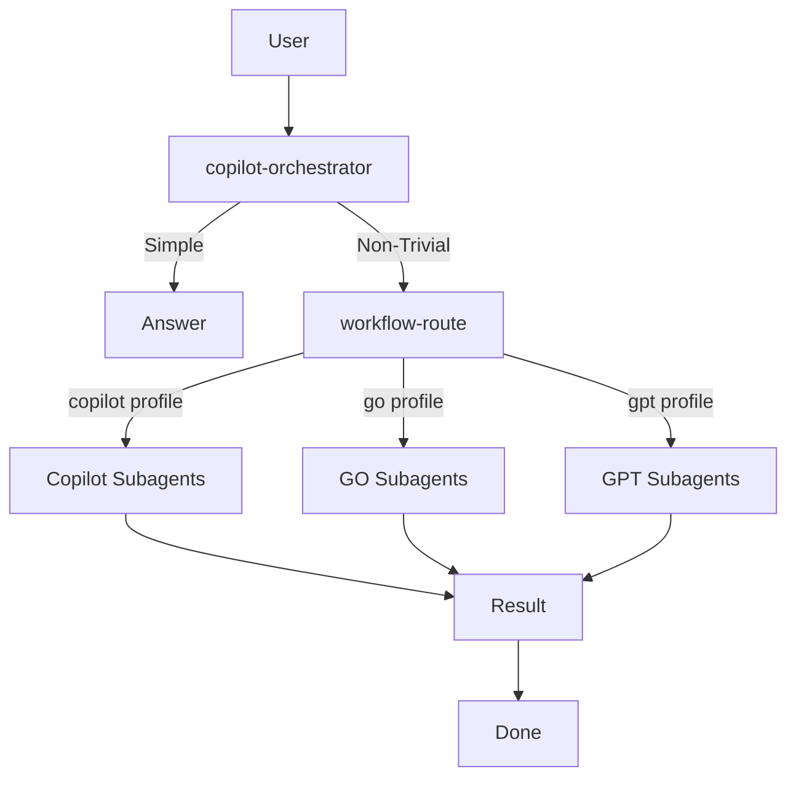

# OpenCode Config

Global OpenCode setup with provider-isolated orchestrators, automatic routing to specialized subagents, GPT planning for large implementation work, and a default GLM final review with GPT escalation only when needed.

## Files

| File | Purpose | Description |
|------|---------|-------------|
| `opencode.json` | Main config | Models, MCP servers, custom commands |
| `AGENTS.md` | Communication rules | Provider isolation and orchestration guidelines |
| `agents/` | Agent definitions | Orchestrator and subagent prompts |
| `tools/workflow-route.ts` | Routing tool | Deterministic task router with provider profiles |
| `WORKFLOW_DIAGRAM.md` | Workflow diagram | Mermaid workflow visualization |

## Orchestrators

This setup uses three provider-isolated orchestrators:

| Orchestrator | Provider | Default Model | Purpose |
|-------------|-----------|---------------|---------|
| `copilot-orchestrator` | GitHub Copilot | `copilot/gpt-5.4` | Primary - uses Copilot subscription |
| `go-orchestrator` | opencode-go | `opencode-go/kimi-k2.6` | Fallback - open models |
| `gpt-orchestrator` | OpenAI | `openai/gpt-5.4` | Future - requires OpenAI subscription |

### Provider Isolation Rule

Each orchestrator may call only models from its own provider:
- Copilot orchestrator → `copilot/*`
- GO orchestrator → `opencode-go/*`
- GPT orchestrator → `openai/*`

## Primary Model (Default)

- default model: `opencode-go/kimi-k2.6`
- default agent: `auto` (uses automatic routing to specialized subagents)
- small_model: `opencode-go/deepseek-v4-flash`

## Configured MCP Servers

### Jira
- type: `remote`
- url: `https://mcp.atlassian.com/mcp`
- enabled: `true`
- Tools: `jira_*` (only enabled for `jira` agent)

## Orchestrator Commands

| Command | Agent | Description |
|---------|-------|-------------|
| `/copilot` | copilot-orchestrator | Primary - GitHub Copilot GPT |
| `/go` | go-orchestrator | Fallback - opencode-go models |
| `/gpt` | gpt-orchestrator | Future - OpenAI models |

## Subagent Commands (Provider-Specific)

### Copilot Subagents
| Command | Agent | Description |
|---------|-------|-------------|
| `/copilot-rca` | copilot-analyzer | Root cause analysis |
| `/copilot-review` | copilot-reviewer | Final review |
| `/copilot-plan` | copilot-planner | Implementation planning |
| `/copilot-code` | copilot-coder | Coding pass |
| `/copilot-ops` | copilot-operator | Tests, git, PR |
| `/copilot-draft` | copilot-writer | Naming, alternatives |

### GO Subagents
| Command | Agent | Description |
|---------|-------|-------------|
| `/go-rca` | go-analyzer | Root cause analysis |
| `/go-review` | go-reviewer | Final review |
| `/go-plan` | go-planner | Implementation planning |
| `/go-code` | go-coder | Coding pass |
| `/go-ops` | go-operator | Tests, git, PR |
| `/go-draft` | go-writer | Naming, alternatives |

### GPT Subagents (Future)
| Command | Agent | Description |
|---------|-------|-------------|
| `/gpt-rca` | gpt-analyzer | Root cause analysis |
| `/gpt-review` | gpt-reviewer | Final review |
| `/gpt-code` | gpt-builder | Coding pass |
| `/gpt-ops` | gpt-operator | Tests, git, PR |
| `/gpt-draft` | gpt-writer | Naming, alternatives |

## General Commands

| Command | Agent | Description |
|---------|-------|-------------|
| `/ship` | auto | End-to-end implementation |
| `/code` | qwen-coder | Fast coding pass (opencode-go) |
| `/ops` | qwen-operator | Tests, git, PR workflow |
| `/rca` | glm-analyzer | Deep root cause analysis |
| `/review` | glm-reviewer | Default final review |
| `/ctx` | kimi-context | Long-context synthesis |
| `/plan` | gpt-planner | Large implementation planning |
| `/draft` | minimax-writer | Naming, copy, alternatives |
| `/judge` | gpt-critic | Second opinion / escalation |
| `/jira` | jira | Jira MCP workflow |

## Installation

### Prerequisites
- OpenCode installed on the machine
- GitHub Copilot configured (`/connect` command)
- Provider authentication configured for additional providers as needed

### Install

```bash
# Clone this repo to your opencode config
git clone https://github.com/williamroberttv/code-setup.git ~/.config/opencode
```

# Or copy manually
mkdir -p ~/.config/opencode
rsync -a opencode/ ~/.config/opencode/

# Install dependencies
cd ~/.config/opencode && npm install
```

### Install RTK (Rust Token Killer)

RTK reduces LLM token consumption by 60-90% on common dev commands.

```bash
# Install RTK (Linux)
curl -fsSL https://raw.githubusercontent.com/rtk-ai/rtk/refs/heads/master/install.sh | sh

# Add to PATH if needed
echo 'export PATH="$HOME/.local/bin:$PATH"' >> ~/.bashrc
source ~/.bashrc

# Initialize for OpenCode
rtk init -g --opencode
```

### Verify Setup

```bash
opencode debug config
opencode agent list
rtk --version
rtk gain
```

Expected:
- `auto` as default agent
- Main model: `opencode-go/kimi-k2.6`
- Custom agents visible in list including: auto, copilot-orchestrator, go-orchestrator, gpt-orchestrator

## Fallback Chain

```
Copilot (primary) → GO (fallback) → GPT (future)
```

If Copilot is unavailable, switch to GO with `/go` command.

## Jira MCP Setup

### Authentication
```bash
opencode mcp list
opencode mcp auth jira
```

### Usage
```bash
# Use Jira command for issue tracking
opencode /jira Create issue for login bug fix
```

## Updating Model Names

If model names change in OpenCode, update in `opencode.json`:

```json
{
  "model": "copilot/NEW_MODEL_NAME",
  "small_model": "copilot/NEW_SMALL_MODEL"
}
```

Also update agent files in `agents/` directory if they have specific model overrides.

## Workflow



## Daily Usage

For normal day-to-day work, use the default (Copilot):

```bash
# Ask normal questions
opencode "How does auth work?"

# Request implementation
opencode "Add login button to header"

# Run tests
opencode "Run the test suite"
```

Use fallback when needed:

```bash
# Switch to GO orchestrator
/opencode /go Fix this bug

# Or use specific provider commands
/opencode /go-rca Why is this failing?
/opencode /go-code Implement feature X
/opencode /go-ops Run tests
```

## Updating Agents

To update agent prompts or add new agents:

1. Edit files in `agents/` directory
2. Changes apply immediately on next opencode session
3. Test with `opencode agent list` to verify

## Troubleshooting

### Agents not appearing
```bash
opencode debug config
```
Check for JSON errors in opencode.json or agent files.

### Model errors
Verify model names are valid with:
```bash
opencode providers
```

### MCP not working
```bash
opencode mcp list
opencode mcp auth jira
```
