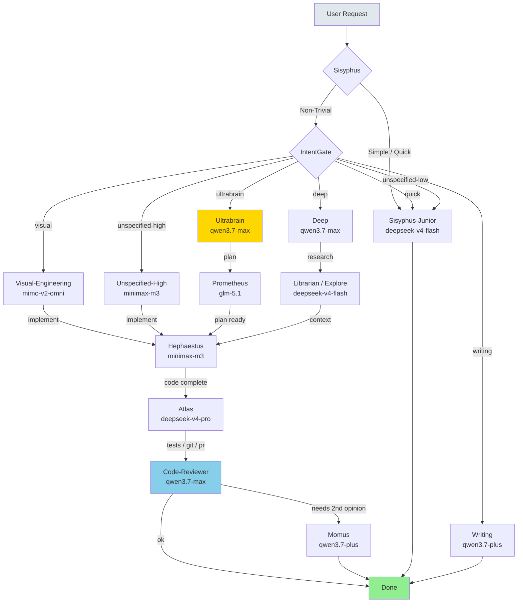

# Workflow Diagram

## Oh My OpenAgent Orchestration Flow



## Agent Roles

| Agent | Primary Model | SWE-Pro | Purpose |
|-------|---------------|---------|---------|
| `sisyphus` | qwen3.7-plus | 57.6% | Main orchestrator, delegates to categories |
| `sisyphus-junior` | deepseek-v4-flash | 79% SWE-Verified | Quick tasks, volume work |
| `hephaestus` | minimax-m3 | 59.0% | Deep autonomous implementation |
| `oracle` | qwen3.7-max | 60.6% | Architecture, RCA, debugging |
| `prometheus` | glm-5.1 | 58.4% | Strategic planning, interview mode |
| `librarian` | deepseek-v4-flash | 79% SWE-Verified | Docs / code search |
| `explore` | deepseek-v4-flash | 79% SWE-Verified | Fast codebase grep |
| `metis` | qwen3.7-plus | 57.6% | Plan consultant |
| `momus` | qwen3.7-plus | 57.6% | Review / critique |
| `atlas` | deepseek-v4-pro | 55.4% | Tests, git, PR workflow |
| `code-reviewer` | qwen3.7-max | 60.6% | Quality review |

## Category Routing

| Category | Use Case | Primary | Fallback Chain |
|----------|----------|---------|----------------|
| `visual-engineering` | Frontend, UI/UX | mimo-v2-omni | claude-sonnet-4 |
| `ultrabrain` | Hard logic, architecture | qwen3.7-max | claude-opus-4 → glm-5.1 |
| `deep` | Autonomous research | qwen3.7-max | claude-opus-4 → minimax-m3 |
| `quick` | Single-file changes | deepseek-v4-flash | mimo-v2.5 |
| `unspecified-low` | Moderate tasks | deepseek-v4-flash | qwen3.7-plus |
| `unspecified-high` | Complex work | minimax-m3 | gpt-5.4 → deepseek-v4-pro |
| `writing` | Docs, naming | qwen3.7-plus | claude-sonnet-4 |
| `artistry` | Creative problem-solving | glm-5.1 | claude-sonnet-4 |

## Fallback Behavior

```
Error / Rate Limit → Blacklist provider 60s → Next fallback model
Go primary fails → Copilot fallback → Go volume fallback
Max 3 attempts per request → Notify on every switch
```

## Common Flows

### Quick Fix
```
sisyphus → sisyphus-junior (deepseek-v4-flash) → done
```

### Standard Implementation
```
sisyphus → hephaestus (minimax-m3) → atlas (deepseek-v4-pro) → code-reviewer (qwen3.7-max)
```

### Large Implementation
```
sisyphus → prometheus (glm-5.1) → hephaestus (minimax-m3) → atlas → code-reviewer
```

### Root Cause Analysis
```
sisyphus → oracle (qwen3.7-max) → hephaestus → atlas → code-reviewer
```

### High-Stakes Review
```
code-reviewer (qwen3.7-max) → momus (qwen3.7-plus) → done
```

## Command Aliases

| Command | Agent | Model |
|---------|-------|-------|
| `/ship` | sisyphus | qwen3.7-plus |
| `/ultrawork` | sisyphus | qwen3.7-plus |
| `/plan` | prometheus | glm-5.1 |
| `/code` | hephaestus | minimax-m3 |
| `/ops` | atlas | deepseek-v4-pro |
| `/rca` | oracle | qwen3.7-max |
| `/review` | code-reviewer | qwen3.7-max |
| `/judge` | momus | qwen3.7-plus |
| `/jira` | jira | qwen3.7-plus |
