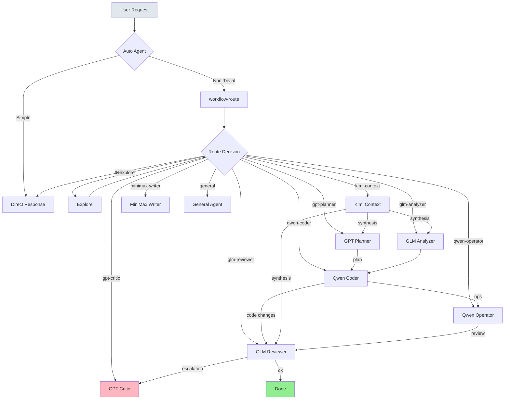
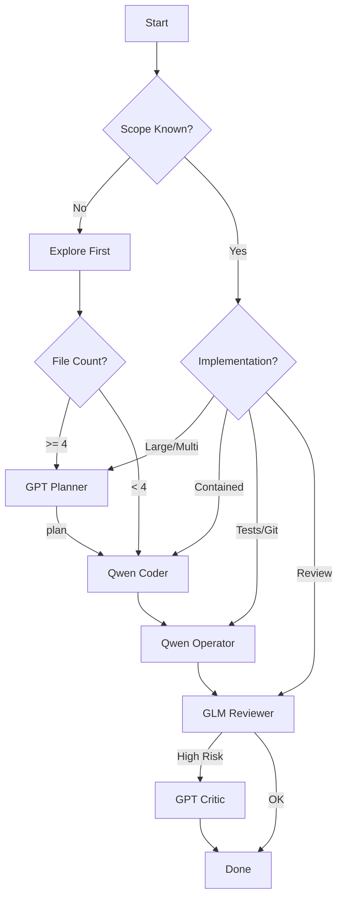

# Workflow Diagram

## Primary Orchestration Flow



## Decision Tree



## Agent Roles

| Agent | Model | Purpose | Tools |
|-------|-------|--------|-------|
| `auto` | Kimi 2.6 | Orchestrator | read, search, context, route |
| `qwen-coder` | MiMo v2.5 Pro | Code implementation | write, edit, bash |
| `qwen-operator` | DeepSeek v4 Flash | Ops (tests, git, PR) | bash, git |
| `glm-analyzer` | GLM-5 | RCA, tradeoffs | read, grep |
| `glm-reviewer` | GLM-5 | Default review | read, grep |
| `gpt-planner` | GPT-5.4 | Large planning | read, grep |
| `gpt-critic` | GPT-5.4 | Escalation review | read, grep |
| `kimi-context` | Kimi 2.6 | Context compression | read |
| `minimax-writer` | MiniMax M2.7 | Creative writing | read |

## Routing Patterns

### Search / Discovery
→ `explore`

### Implementation (scope unknown)
→ `explore` → measure → rerun with scopeKnown=true

### Implementation (large, multi-file)
→ `gpt-planner` → `qwen-coder`

### Implementation (contained, 1-3 files)
→ `qwen-coder`

### RCA / Debugging / Tradeoffs
→ `glm-analyzer`

### Tests / Git / PR
→ `qwen-operator`

### Review Only
→ `glm-reviewer` → escalate to `gpt-critic` if high-stakes

### Large Context
→ `kimi-context` → route to appropriate agent

### Naming / Writing / Brainstorming
→ `minimax-writer`

### Independent Parallel Work
→ `general` → split and integrate

## Common Flows

### Code Change + Repo Ops
```
qwen-coder → qwen-operator → glm-reviewer
```

### Large Implementation
```
explore → gpt-planner → qwen-coder → qwen-operator → glm-reviewer
```

### Large Context Bug
```
kimi-context → glm-analyzer → qwen-coder → qwen-operator → glm-reviewer
```

### High-Stakes Review
```
glm-reviewer → gpt-critic (escalation)
```

## Command Aliases

| Command | Agent | Model |
|---------|-------|-------|
| `/ship` | auto | Kimi 2.6 |
| `/code` | qwen-coder | MiMo Pro |
| `/ops` | qwen-operator | DeepSeek Flash |
| `/rca` | glm-analyzer | GLM-5 |
| `/review` | glm-reviewer | GLM-5 |
| `/ctx` | kimi-context | Kimi 2.6 |
| `/plan` | gpt-planner | GPT-5.4 |
| `/draft` | minimax-writer | MiniMax M2.7 |
| `/judge` | gpt-critic | GPT-5.4 |